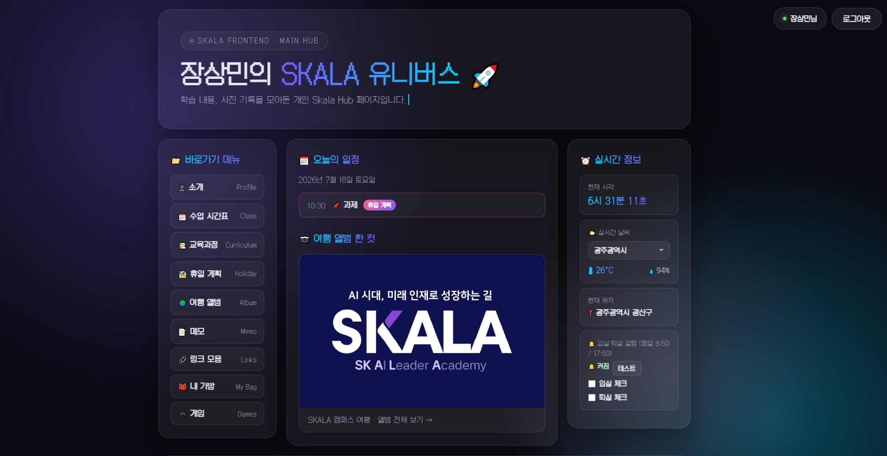
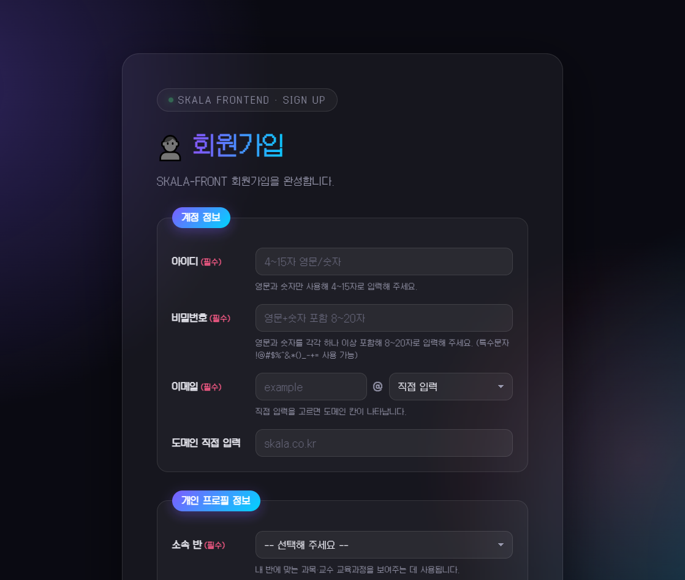
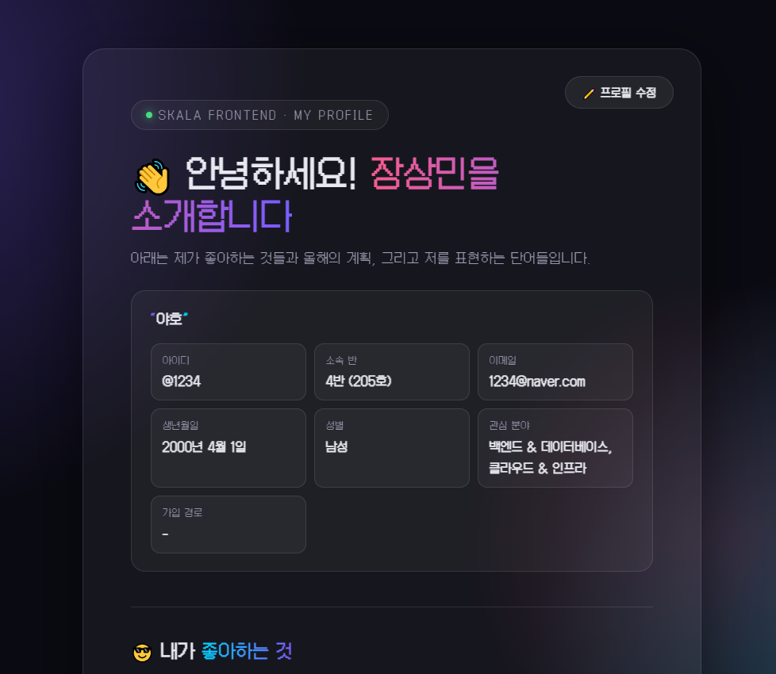
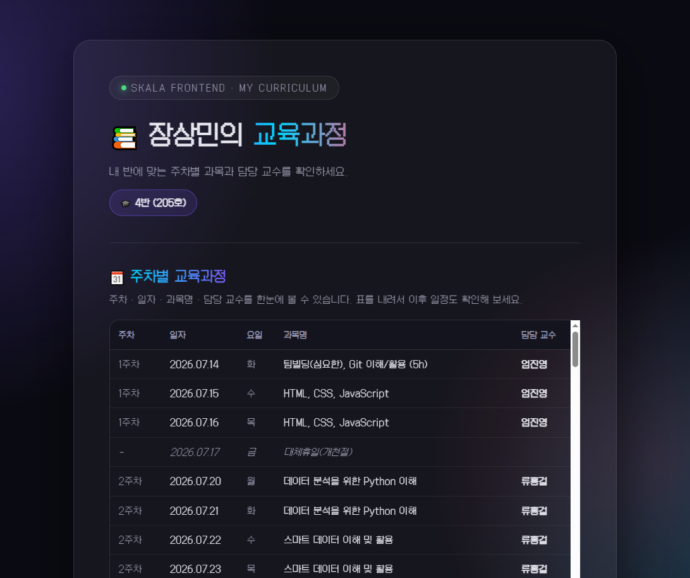
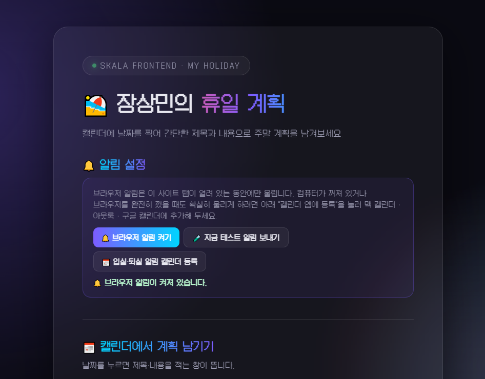
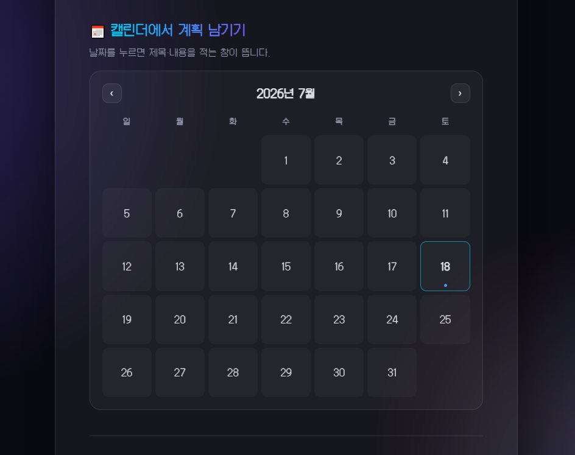
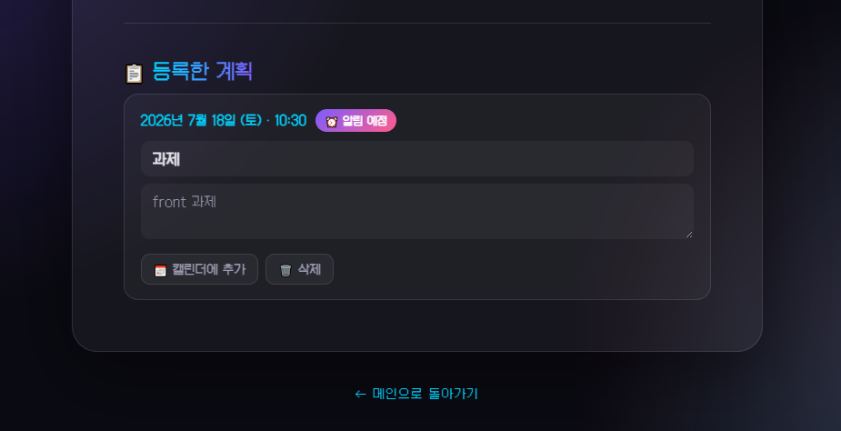
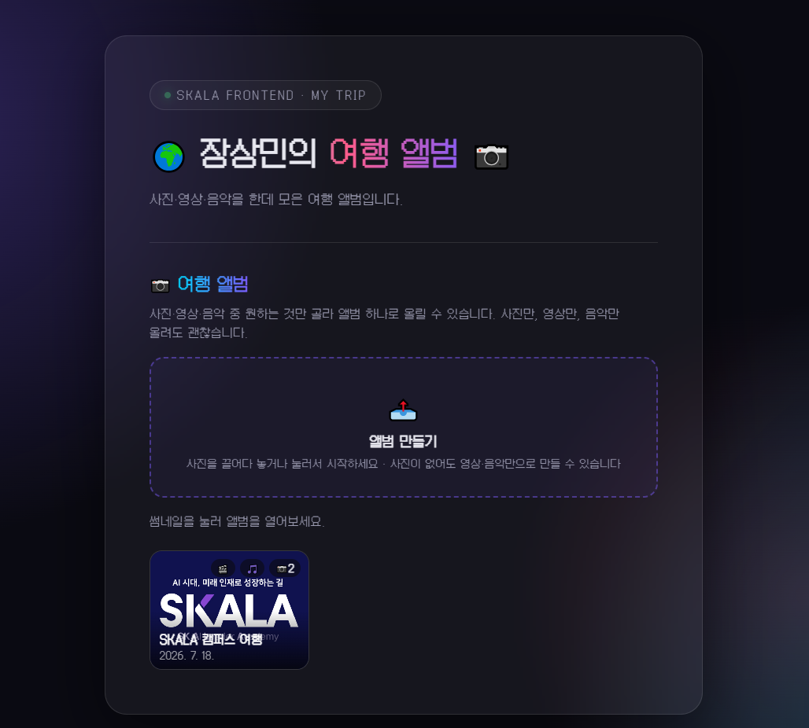
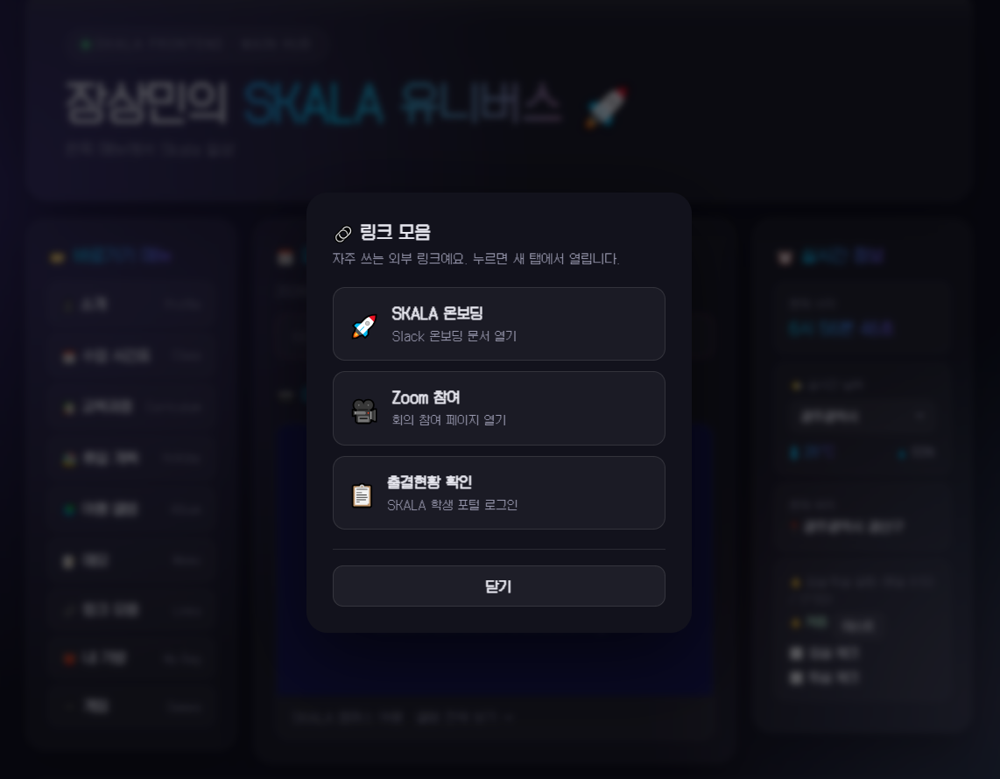
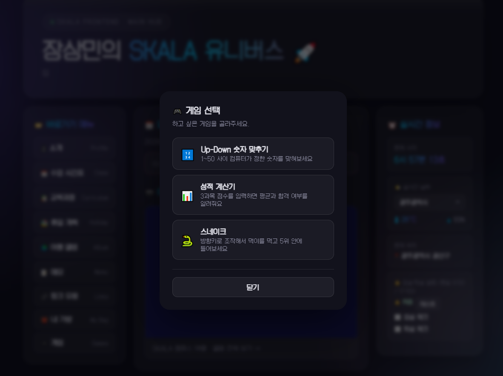

# 🚀 SKALA-FRONT


-555)

SKALA 과정중 필요한 것들을 **개인 포털 하나**로 묶어봤다. 서버 없이 정적 파일과
브라우저 저장소(`localStorage`)만으로 회원가입, 개인화, 데이터 저장까지 전부 처리한다.

**🔗 배포 주소: [skala-front-jet.vercel.app](https://skala-front-jet.vercel.app/)**
— 메인 Hub는 로그인 전엔 화면이 흐리게 가려져 있다
  회원가입이 우선이다 필수!

<br/>

## 📑 목차

- ⚡ [빠르게 훑어보기](#빠르게-훑어보기)
- 🧭 [페이지 & 기능](#페이지--기능)
- ✨ [추가한 내용](#추가한-내용)
- 🎨 [개인화 기능 살펴보기](#개인화-기능-살펴보기)
- 🏗️ [구조설명](#구조설명)
- 💡 [그 외의 것들](#그-외의-것들)
- 🗂️ [폴더 구조](#폴더-구조)

<br/>

## ⚡ 빠르게 훑어보기

로컬에서 열 때는 `http://`로만 서빙되면 된다. 실시간 날씨 기능이 ES 모듈
(`import`/`export`)을 쓰는데, `file://`로 더블클릭해서 열면 브라우저가 CORS
정책 때문에 모듈 로드를 막아버린다. VS Code **Live Server 확장**이 있다면
그걸로 여는 게 가장 간단하고, 따로 없다면 아래처럼 파이썬 내장 서버를 써도
충분하다.

```bash
python -m http.server 8420
# → http://localhost:8420/html/index.html
```

🚀 배포는 Vercel을 사용하였다. 실제 페이지는 전부 `html/` 아래에 있어서, 루트(`/`)와
`/이름.html` 요청을 그 안의 파일로 이어주는 `vercel.json` rewrite 두 줄이면 충분하다.

```json
{ "rewrites": [
  { "source": "/", "destination": "/html/index.html" },
  { "source": "/:page.html", "destination": "/html/:page.html" }
] }
```

<br/>

## 🧭 페이지 & 기능

| 페이지 | 기능 | 구현 사항들 |
|---|---|---|
| 🏠 `index.html` | 로그인한 회원의 개인 포털 허브 | `<nav>`/`<main>`/`<aside>` 3단, 비로그인 시 전체 블러, 오늘의 일정 자동 합산 |
| ✍️ `signUp.html` → `signUpResult.html` | 회원가입 → 가입 완료 | 아이디·비밀번호 실시간 형식 검사, 중복 확인, 비밀번호 SHA-256 해시 |
| 🔑 `logIn.html` | 로그인 | 세션은 `localStorage`, 잘못 입력 시 인라인 에러 |
| 👤 `myProfile.html` | 자기소개 | `<ul>`(좋아하는 것)·`<ol>`(할 일)·`<dl>`(단어) 조합, 로그인 후 직접 수정 |
| 📅 `myClass.html` | 주간 강의 시간표 | `<table>` + `rowspan`/`colspan` 셀 병합 (점심시간 5칸 병합) |
| 📚 `myCurriculum.html` | 반별 교육과정 | 가입 때 고른 반에 따라 주차·과목·담당 교수가 달라짐 |
| 🏖️ `myHoliday.html` | 휴일 계획 캘린더 | 날짜 클릭해 계획 등록, 시각 지정 시 알림 + `.ics` 내보내기 |
| 🌍 `myTrip.html` | 여행 앨범 | 사진·영상·음악 중 고른 것만 앨범 하나로 업로드, 사진은 자동 축소 압축 |
| 📝 `myMemo.html` | 개인 메모장 | 회원별 저장, 제목/내용 인라인 수정 |
| 🎮 `index.html` 안 미니앱 | Up-Down 숫자 맞히기 · 성적 계산기 · 내 가방 · 스네이크 게임 | 전부 `<dialog>` 모달로 진행, 스네이크는 `<canvas>` + 회원별 TOP 3 |

<br/>

## ✨ 추가한 내용

추가한 기능들 🙌

- 🔒 **비밀번호는 평문으로 저장하지 않는다** — Web Crypto의 `crypto.subtle.digest`로 SHA-256 해시만
  `localStorage`에 남기고, 회원가입 화면에서도 아이디·비밀번호를 입력하는 즉시 정규식으로
  형식을 검사해 초록/빨강으로 알려준다.
- 🐍 **스네이크 게임** — 방향키로 조작하는 `<canvas>` 게임. 시작 전 3·2·1 카운트다운, 죽으면
  캔버스 위에 바로 "다시 하기"가 겹쳐 뜨고, 순위표는 회원별로 🥇🥈🥉 3위까지만 남는다.
- ☀️ **실시간 날씨** — 도시를 고르면(`<select>` `change`) Open-Meteo API를 `fetch`+`async/await`로
  호출한다. 데이터 처리(`weatherAPI.js`)와 화면 그리기(`realtimeInfo.js`)를 ES 모듈로 분리했다.
- 🔤 **폰트를 직접 서빙** — 픽셀 폰트(Galmuri14)를 외부 CDN에 계속 걸어뒀더니 새로고침마다
  살짝 늦게 뒤바뀌어 보이는 게 거슬려서, 실제 쓰는 굵기 하나만 프로젝트에 내려받아
  `@font-face`로 직접 서빙하도록 바꿨다.
- 🌙 **Dark Reader 같은 확장 프로그램 방지** — 이미 다크 테마 전용으로 만든 사이트인데,
  다크모드 확장이 그라디언트 텍스트를 뭉개버리는 걸 발견해서 `<meta name="darkreader-lock">`로
  막았다.
- 🔔 **알림 + 캘린더 내보내기** — 입실·퇴실 브라우저 알림과 `.ics` 파일(맥 캘린더/아웃룩/구글
  캘린더용) 내보내기를 같이 넣어서, 탭을 닫아둬도 일정 알림은 받을 수 있게 했다.

<br/>

## 🎨 개인화 기능 살펴보기

로그인한 회원마다 다르게 채워지는 화면들을, 메인 허브부터 순서대로 실제로 캡처해봤다. 📸

### 1. 🏠 메인 허브

로그인하면 이름이 제목에 들어가고, 사이드바에는 실시간 날씨·시각과 함께
평일 8:50/17:50 입실·퇴실 알림 on/off, 오늘의 입실·퇴실 체크박스가 함께 뜬다.

<p align="center">
  
</p>

### 2. ✍️ 회원가입 — 소속 반 선택

가입 폼에서 아이디·비밀번호와 함께 소속 반을 고르는데, 이 값이 나중에
교육과정 페이지를 결정한다.

<p align="center">
  
</p>

### 3. 👋 나의 소개

가입 때 입력한 프로필(아이디·소속 반·이메일·생년월일·성별·관심 분야)이
그대로 카드에 채워진다.

<p align="center">
  
</p>

### 4. 📚 나의 교육과정 — 반별로 달라지는 표

회원가입 때 고른 반이 그대로 반영돼서, 그 반의 주차별 과목·요일·담당 교수만 나온다.

<p align="center">
  
</p>

### 5. ⏰ 휴일 계획 — 시각 맞춰 알림

브라우저 알림을 켜두고 캘린더에서 날짜를 골라 계획을 남기면, 시각을 적어둔
계획은 그 시각에 알림이 온다.

<p align="center">
  
</p>
<p align="center">
  
</p>
<p align="center">
  
</p>

### 6. 📝 메모

`myMemo.html`은 회원마다 따로 저장되는 개인 메모장이다. (텍스트 위주라 스크린샷은 생략)

### 7. 🌍 여행 앨범

사진·영상·음악 중 원하는 것만 골라 앨범 하나로 올릴 수 있고, 모든 회원은
기본으로 SKALA 캠퍼스 여행 앨범을 하나씩 갖고 시작한다.

<p align="center">
  
</p>

### 8. 🔗🎮 링크 모음 · 게임 — 사이드바 미니 메뉴

메인 허브 사이드바의 버튼 두 개는 페이지 이동 대신 모달을 띄운다. 하나는
자주 쓰는 외부 링크(Slack 온보딩, Zoom, 출결 포털) 모음이고, 다른 하나는
미니 게임(Up-Down, 성적 계산기, 스네이크) 선택 창이다.

<p align="center">
  
  
</p>

<br/>

## 🏗️ 구조설명

### 🎨 스타일링 — `css/global.css` + 페이지별 CSS

색상·간격 같은 디자인 토큰은 `:root` 커스텀 프로퍼티로 `global.css`에 몰아넣고 모든
페이지가 공통으로 링크한다. 페이지 고유 스타일(카드 폭, 배지 크기 등)은 그 페이지의
CSS 파일에만 남겨 공통 파일이 비대해지지 않게 했다. 애니메이션은 `@keyframes`/`transition`,
그라디언트 텍스트는 `background-clip: text`, 카드 유리 효과는 `backdrop-filter`.
786px 이하에서는 3단 레이아웃이 세로 1열로 접힌다.

### 🧩 스크립트 — 회원별 저장은 전부 `js/core/auth.js`를 거친다

로그인/회원가입/개인화 로직을 `js/core/auth.js` 하나에 모으고, 나머지 기능(알림,
정적 데이터, 날씨)은 성격에 따라 `js/features/`, `js/data/`로 나눴다. 미니앱 4종
(`upDown.js`, `grade.js`, `bag.js`, `snake.js`)은 `script/`에 따로 둬서 "게임/도구"
성격의 코드와 "사이트 기반" 코드를 구분했다. 소개·여행 앨범·휴일 계획·메모·가방·
스네이크 순위표까지, 회원별 데이터는 전부 `localStorage`에 아이디를 키로 따로
저장한다.

### 🛠️ 기술 스택 요약

| 구분 | 사용한 것들 |
|---|---|
| 🧱 HTML | 시맨틱 태그, `<form method="get">`, `<table>` 셀 병합, `<dialog>`, `<canvas>`, `<ul>`/`<ol>`/`<dl>` |
| 🎨 CSS | 커스텀 프로퍼티, Flexbox/Grid, `@keyframes`, `backdrop-filter`, `@font-face` 자체 호스팅 |
| ⚙️ JS | ES Module, `fetch`+`async/await`, Web Crypto(SHA-256), Canvas 루프, `localStorage`, Notification API |
| 🌐 외부 연동 | [Open-Meteo](https://open-meteo.com)(날씨, 키 불필요) |
| 🚀 배포 | Vercel + `vercel.json` rewrite |

<br/>

## 💡 그 외의 것들

- 🔐 비밀번호는 SHA-256 해시로만 저장하고있다. 로컬스토리지에만 저장하기때문에 다른 기기에는 한계가 있다.
  여전하다. 실제 서비스라면 서버에서 salt를 더해 검증해야 한다.
- 🔕 브라우저 알림은 이 탭이 열려 있을 때만 울린다. 컴퓨터를 꺼둬도 알림을 받으려면
  `.ics` 캘린더 등록 쪽을 쓰면 된다.
- 🕵️ 모든 데이터가 `localStorage` 기준이라 브라우저·시크릿 모드·다른 기기에서는 가입
  정보와 게시물이 보이지 않는다.

<br/>

## 🗂️ 폴더 구조

```
skala-front/
├─ html/                 페이지 전부 (index, signUp/signUpResult, logIn, myProfile,
│                         myClass, myCurriculum, myHoliday, myTrip, myMemo)
├─ css/
│  ├─ global.css         공통 디자인 토큰 · 리셋 · 오로라 배경 · 애니메이션
│  ├─ fonts/             Galmuri14 자체 호스팅 폰트
│  └─ (페이지명).css      페이지별 스타일
├─ js/
│  ├─ core/auth.js       회원가입 · 로그인 · 개인화 (저장은 전부 여기를 거친다)
│  ├─ data/              timetable.js · curriculum.js — 정적 데이터
│  └─ features/          alarms.js · weatherAPI.js · realtimeInfo.js
├─ script/               upDown.js · grade.js · bag.js · snake.js — 미니앱 4종
├─ media/                기본 앨범용 이미지 · 영상 · 음악
├─ screenshots/          이 README에 쓰는 스크린샷
└─ vercel.json           배포 rewrite 설정
```
